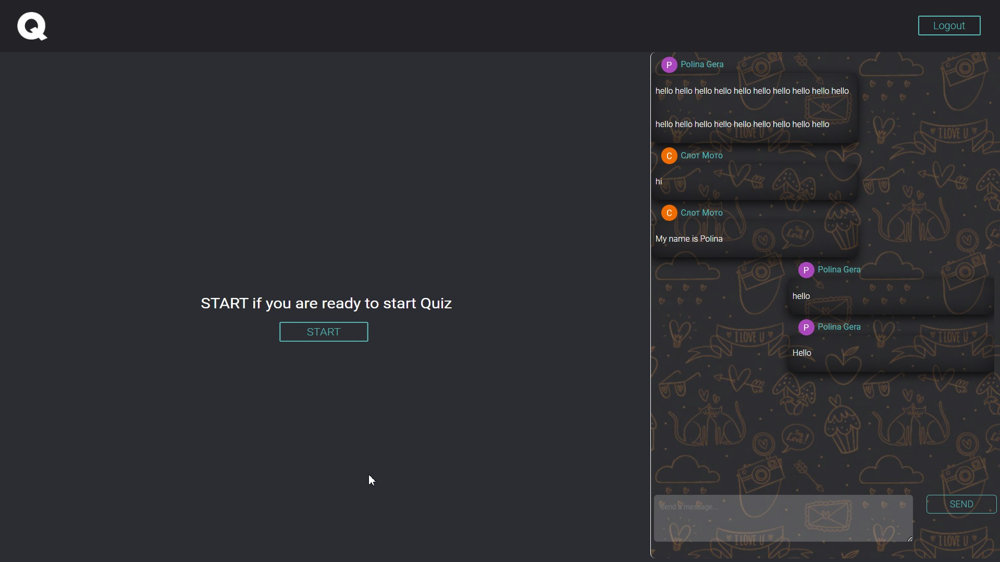
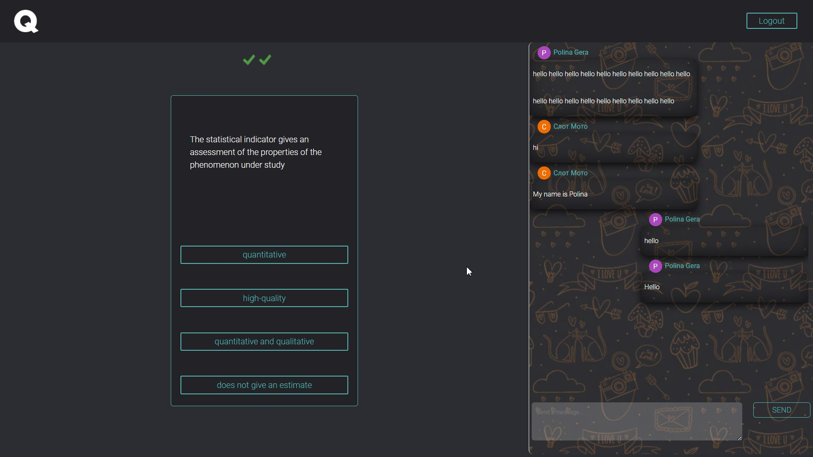
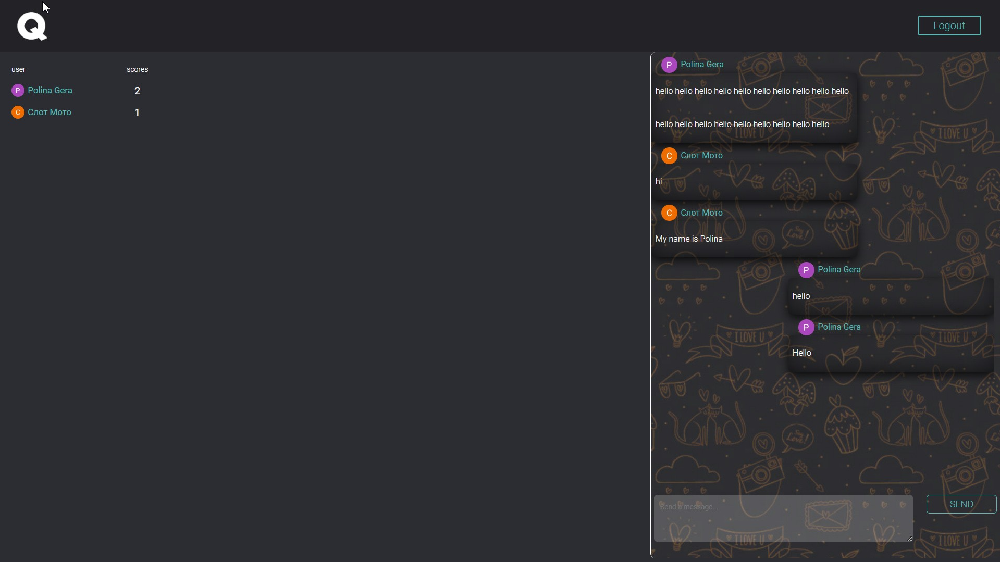

<h1 align="center">Chat/Quiz Website</h1>
<h2 align="center">


<h2 align="center"><a  href="https://joyful-starship-e5ef78.netlify.app/">Live Demo</a></h2>


## Description

**Этот сайт создан для студентов. В нем есть возможность авторизации через google, онлайн-чат и квиз для того, чтобы студенты могли проверить свои знания и посмотреть результаты.** <br><br>
**This site is created for students. It has the ability to log in via Google, online chat and a quiz so that students can test their knowledge and see the results.**

<p align="center">
</p>

На главной странице отображается онлайн-чат и кнопка готовности к квизу. Квиз начинается, когда все студенты готовы пройти тест.<br> <br>
The main page displays an online chat and a ready for quiz button. The quiz begins when all students are ready to take the test..

<p align="center">
</p>

Так выглядит квиз, студент просто выбирает правильный ответ.<br><br>
This is what the quiz looks like, the student just chooses the correct answer.


<p align="center">
</p>

После прохождения квиза появляется таблица с результатами.<br><br>
After passing the quiz, a table with the results appears.


<p align="center">
</p>


**Это приложение разработано с помощью библиотеки React. Для хранения используется сервис Firebase.**<br>
**This application is developed using the React library. Firebase RealtimeDatabse service is used for storage.**

## Project setup

```
npm install
npm run build
```